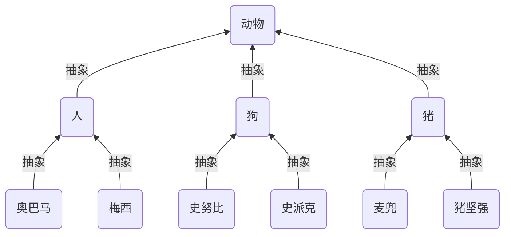
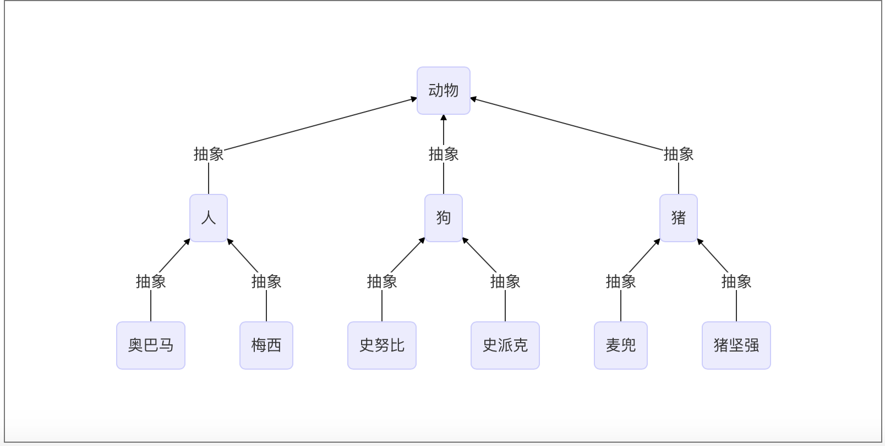
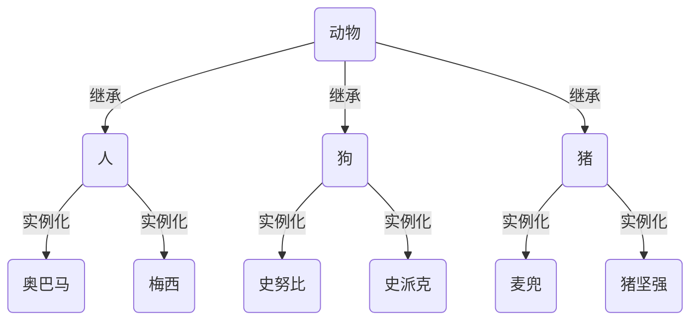
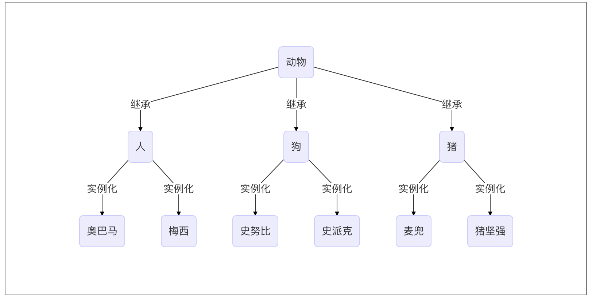

<!-- TOC depthFrom:1 depthTo:6 withLinks:1 updateOnSave:1 orderedList:0 -->

- [Python面向对象设计和类](#python面向对象设计和类)
	- [教程](#教程)
	- [面向对象的程序设计的由来](#面向对象的程序设计的由来)
		- [程序设计思想发展](#程序设计思想发展)
			- [1940年以前：面向机器](#1940年以前面向机器)
			- [脱离机器第一步：面向过程](#脱离机器第一步面向过程)
			- [第一次软件危机：结构化程序设计](#第一次软件危机结构化程序设计)
			- [第二次软件危机：面向对象程序设计](#第二次软件危机面向对象程序设计)
		- [详细发展历史](#详细发展历史)
	- [什么是面向对象的程序设计](#什么是面向对象的程序设计)
		- [面向过程](#面向过程)
	- [类与对象](#类与对象)
		- [类](#类)
		- [对象](#对象)
		- [思考](#思考)
		- [初始化方法](#初始化方法)
		- [内置的特殊属性](#内置的特殊属性)
	- [属性查找](#属性查找)
	- [对象之间的交互](#对象之间的交互)
	- [继承与派生](#继承与派生)
		- [定义](#定义)
		- [抽象与继承](#抽象与继承)
		- [继承与重用性](#继承与重用性)
		- [派生](#派生)
		- [组合与重用性](#组合与重用性)
		- [接口与归一化设计](#接口与归一化设计)
			- [什么是接口](#什么是接口)
			- [为什么要用接口](#为什么要用接口)
			- [模仿interface](#模仿interface)
		- [抽象类](#抽象类)
			- [什么是抽象类](#什么是抽象类)
			- [为什么要有抽象类](#为什么要有抽象类)
			- [在python中实现抽象类](#在python中实现抽象类)
			- [抽象类与接口](#抽象类与接口)
		- [继承实现的原理](#继承实现的原理)
			- [继承顺序](#继承顺序)
			- [继承原理](#继承原理)
		- [子类中调用父类的方法](#子类中调用父类的方法)
	- [多态与多态性](#多态与多态性)
		- [多态](#多态)
		- [多态性](#多态性)
		- [鸭子类型](#鸭子类型)
	- [封装](#封装)
		- [隐藏](#隐藏)
		- [封装不是隐藏](#封装不是隐藏)
			- [封装数据](#封装数据)
			- [封装方法](#封装方法)
			- [特性property](#特性property)
	- [绑定方法与非绑定方法](#绑定方法与非绑定方法)
		- [绑定方法](#绑定方法)
		- [非绑定方法](#非绑定方法)
		- [练习](#练习)
	- [Python中关于OOP的常用术语](#python中关于oop的常用术语)
	- [面向对象的软件开发](#面向对象的软件开发)

<!-- /TOC -->

# Python面向对象设计和类

> 2019-09-16 Booboowei


## 教程

[Python老男孩](https://www.cnblogs.com/linhaifeng/articles/6182264.html)

## 面向对象的程序设计的由来

### 程序设计思想发展

#### 1940年以前：面向机器

最早的程序设计都是采用机器语言来编写的,直接使用二进制码来表示机器能够识别和执行的指令和数 据。简单来说,就是直接编写 0 和 1 的序列来代表程序语言。例如:使用 0000 代表 加载(LOAD),0001 代表 存储(STORE)等。

```
机器语言由机器直接执行,速度快,但一个很明显的缺点就是:写起来实在是太困难了,一旦你发现自己
写错了,改起来更蛋疼!这样直接导致程序编写效率十分低下,编写程序花费的时间往往是实际运行时间
的几十倍或几百倍。
```

有一个关于机器语言和比尔盖茨的笑话,是说比尔盖茨拿着绣花针在一张光盘上戳,把 Windows 给戳出 来了!但如果真的让你去戳,不要说 Windows,连一个简单的“Hello world”都要让人戳到眼睛冒烟!

由于机器语言实在是太难编写了,于是就发展出了汇编语言。汇编语言亦称符号语言,用助记符代替机器 指令的操作码,用地址符号(Symbol)或标号(Label)代替指令或操作数的地址,。汇编语言由于是采用 了助记符号来编写程序,比用机器语言的二进制代码编程要方便些,在一定程度上简化了编程过程。例如 使用 LOAD 来代替 0000,使用 STORE 来代替 0001。

即使汇编语言相比机器语言提升了可读性,但其本质上还是一种面向机器的语言,编写同样困难,也很容 易出错。相信很多计算机毕业的学生至今都对学校的汇编课程中的练习程序心有余悸。

#### 脱离机器第一步：面向过程

面向机器的语言通常情况下被认为是一种“低级语言”,为了解决面向机器的语言存在的问题,计算机科 学的前辈们又创建了面向过程的语言。面向过程的语言被认为是一种“高级语言”,相比面向机器的语言 来说,面向过程的语言已经不再关注机器本身的操作指令、存储等方面,而是关注如何一步一步的解决具体的问题,即:解决问题的过程,这应该也是面向过程说法的来由。

相比面向机器的思想来说,面向过程是一次思想上的飞跃,将程序员从复杂的机器操作和运行的细节中解 放出来,转而关注具体需要解决的问题;面向过程的语言也不再需要和具体的机器绑定,从而具备了移植 性和通用性;面向过程的语言本身也更加容易编写和维护。这些因素叠加起来,大大减轻了程序员的负担, 提升了程序员的工作效率,从而促进了软件行业的快速发展。

典型的面向过程的语言有:COBOL、FORTRAN、BASIC、C 语言等。

#### 第一次软件危机：结构化程序设计

根本原因就是一些面向过程语言中的goto语句导致的面条式代码，极大的限制了程序的规模。**结构化程序设计**（英语：Structured programming），一种编程范型。它采用子程序（函数就是一种子程序）、代码区块、for循环以及while循环等结构，来替换传统的goto。希望借此来改善计算机程序的明晰性、质量以及开发时间，并且避免写出面条式代码。

随着计算机硬件的飞速发展,以及应用复杂度越来越高,软件规模越来越大,原有的程序开发方式已经越 来越不能满足需求了。1960 年代中期开始爆发了第一次软件危机,典型表现有软件质量低下、项目无法 如期完成、项目严重超支等,因为软件而导致的重大事故时有发生。例如 1963 年美国 (http://en.wikipedia.org/wiki/Mariner_1) 的水手一号火箭发射失败事故,就是因为一行 FORTRAN 代码 错误导致的。

软件危机最典型的例子莫过于 IBM 的 System/360 的操作系统开发。佛瑞德·布鲁克斯(Frederick P. Brooks, Jr.)作为项目主管,率领 2000 多个程序员夜以继日的工作,共计花费了 5000 人一年的工作量,写出将 近 100 万行的源码,总共投入 5 亿美元,是美国的“曼哈顿”原子弹计划投入的 1/4。尽管投入如此巨大, 但项目进度却一再延迟,软件质量也得不到保障。布鲁克斯后来基于这个项目经验而总结的《人月神话》 一书,成了史上最畅销的软件工程书籍。

为了解决问题,在 1968、1969 年连续召开两次著名的 NATO 会议,会议正式创造了“软件危机”一词, 并提出了针对性的解决方法“软件工程”。虽然“软件工程”提出之后也曾被视为软件领域的银弹,但后 来事实证明,软件工程同样无法解决软件危机。

差不多同一时间,“结构化程序设计”作为另外一种解决软件危机的方案被提出来了。 Edsger Dijkstra 于 1968 发表了著名的《GOTO 有害论》的论文,引起了长达数年的论战,并由此产生了结构化程序设计方 法。同时,第一个结构化的程序语言 Pascal 也在此时诞生,并迅速流行起来。

结构化程序设计的主要特点是抛弃 goto 语句,采取“自顶向下、逐步细化、模块化”的指导思想。结构 化程序设计本质上还是一种面向过程的设计思想,但通过“自顶向下、逐步细化、模块化”的方法,将软 件的复杂度控制在一定范围内,从而从整体上降低了软件开发的复杂度。结构化程序方法成为了 1970 年 代软件开发的潮流。

科学研究证明,人脑存在人类短期记忆一般一次只能记住 5-9 个事物,这就是著名的 7+- 2 原理。结构化程序设计是面向过程设计思想的一个改进,使得软件开发更加符合人类思维的 7+-2 特点。

#### 第二次软件危机：面向对象程序设计

结构化编程的风靡在一定程度上缓解了软件危机,然而好景不长,随着硬件的快速发展,业务需求越来越

复杂,以及编程应用领域越来越广泛,第二次软件危机很快就到来了。

第二次软件危机的根本原因还是在于软件生产力远远跟不上硬件和业务的发展,相比第一次软件危机主要 体现在“复杂性”,第二次软件危机主要体现在“可扩展性”、“可维护性”上面。传统的面向过程(包括 结构化程序设计)方法已经越来越不能适应快速多变的业务需求了,软件领域迫切希望找到新的银弹来解 决软件危机,在这种背景下,面向对象的思想开始流行起来。

面向对象的思想并不是在第二次软件危机后才出现的,早在 1967 年的 Simula 语言中就开始提出来了,但 第二次软件危机促进了面向对象的发展。 面向对象真正开始流行是在 1980s 年代,主要得益于 C++的功 劳,后来的 Java、C#把面向对象推向了新的高峰。到现在为止,面向对象已经成为了主流的开发思想。

虽然面向对象开始也被当做解决软件危机的银弹,但事实证明,和软件工程一样,面向对象也不是银弹, 而只是一种新的软件方法而已。

虽然面向对象并不是解决软件危机的银弹,但和面向过程相比,面向对象的思想更加贴近人类思维的特点, 更加脱离机器思维,是一次软件设计思想上的飞跃。

### 详细发展历史

[详细发展历史](https://www.cnblogs.com/linhaifeng/articles/6428835.html)

## 什么是面向对象的程序设计

### 面向过程

面向过程的程序设计：核心是过程二字，过程指的是解决问题的步骤，即先干什么再干什么......面向过程的设计就好比精心设计好一条流水线，是一种机械式的思维方式。

* **优点是：复杂度的问题流程化，进而简单化（一个复杂的问题，分成一个个小的步骤去实现，实现小的步骤将会非常简单）**

* **缺点是：一套流水线或者流程就是用来解决一个问题，生产汽水的流水线无法生产汽车，即便是能，也得是大改，改一个组件，牵一发而动全身。**

应用场景：一旦完成基本很少改变的场景，著名的例子有Linux內核，git，以及Apache HTTP Server等。

 ### 面向对象

面向对象的程序设计：核心是对象二字。要理解对象为何物，必须把自己当成上帝，上帝眼里世间存在的万物皆为对象，不存在的也可以创造出来。

面向对象的程序设计好比如来设计西游记

```js
如来要解决的问题是把经书传给东土大唐，如来想了想解决这个问题需要四个人：唐僧，沙和尚，猪八戒，孙悟空。
每个人都有各自的特征和技能（这就是对象的概念，特征和技能分别对应对象的数据属性和方法属性）
然而这并不好玩，于是如来又安排了一群妖魔鬼怪，为了防止师徒四人在取经路上被搞死，又安排了一群神仙保驾护航，这些都是对象。
然后取经开始，师徒四人与妖魔鬼怪神仙交互着直到最后取得真经。

如来根本不会管师徒四人按照什么流程去取。
```

**对象**是特征与技能的结合体，基于面向对象设计程序就好比在创造一个世界，你就是这个世界的上帝，存在的皆为对象，不存在的也可以创造出来，与面向过程机械式的思维方式形成鲜明对比，面向对象更加注重对现实世界的模拟，是一种“上帝式”的思维方式。

* **优点是：解决了程序的扩展性。对某一个对象单独修改，会立刻反映到整个体系中，如对游戏中一个人物参数的特征和技能修改都很容易。**

* **缺点：**
  * 编程的复杂度远高于面向过程，不了解面向对象而立即上手基于它设计程序，极容易出现过度设计的问题。一些扩展性要求低的场景使用面向对象会徒增编程难度，比如管理linux系统的shell脚本就不适合用面向对象去设计，面向过程反而更加适合。
  * 无法向面向过程的程序设计流水线式的可以很精准的预测问题的处理流程与结果，面向对象的程序一旦开始就由对象之间的交互解决问题，即便是上帝也无法准确地预测最终结果。于是我们经常看到对战类游戏，新增一个游戏人物，在对战的过程中极容易出现阴霸的技能，一刀砍死3个人，这种情况是无法准确预知的，只有对象之间交互才能准确地知道最终的结果。

应用场景：需求经常变化的软件，一般需求的变化都集中在用户层，互联网应用，企业内部软件，游戏等都是面向对象的程序设计大显身手的好地方。

面向对象的程序设计并不是全部。对于一个软件质量来说，面向对象的程序设计只是用来解决扩展性。

## 类与对象

### 类

类即类别、种类，是面向对象设计最重要的概念，是一系列对象相似的特征与技能的结合体

### 对象

对象是特征与技能的结合体。

### 思考

那么问题来了，先有的一个个具体存在的对象（比如一个具体存在的人），还是先有的人类这个概念，这个问题需要分两种情况去看：

**在现实世界中：先有对象，再有类**

*世界上肯定是先出现各种各样的实际存在的物体，然后随着人类文明的发展，人类站在不同的角度总结出了不同的种类，如人类、动物类、植物类等概念*。

*也就说，对象是具体的存在，而类仅仅只是一个概念，并不真实存在*

```js
在现实世界中：先有对象，再有类
对象1：李坦克
    特征:
        学校=oldboy
        姓名=李坦克
        性别=男
        年龄=18
    技能：
        学习
        吃饭
        睡觉

对象2：王大炮
    特征:
        学校=oldboy
        姓名=王大炮
        性别=女
        年龄=38
    技能：
        学习
        吃饭
        睡觉

对象3：牛榴弹
    特征:
        学校=oldboy
        姓名=牛榴弹
        性别=男
        年龄=78
    技能：
        学习
        吃饭
        睡觉


现实中的老男孩学生类
    相似的特征:
        学校=oldboy
    相似的技能：
        学习
        吃饭
        睡觉

在现实世界中：先有对象，再有类
```


**在程序中：务必保证先定义类，后产生对象**

*这与函数的使用是类似的，先定义函数，后调用函数，类也是一样的，在程序中需要先定义类，后调用类*

*不一样的是，调用函数会执行函数体代码返回的是函数体执行的结果，而调用类会产生对象，返回的是对象。*

```js
在程序中，务必保证：先定义（类），后使用（产生对象）
PS:
  1. 在程序中特征用变量标识，技能用函数标识
  2. 因而类中最常见的无非是：变量和函数的定义

"""程序中的类"""
class OldboyStudent:
    school='oldboy'
    def learn(self):
        print('is learning')

    def eat(self):
        print('is eating')

    def sleep(self):
        print('is sleeping')


"""注意：
  1.类中可以有任意python代码，这些代码在类定义阶段便会执行
  2.因而会产生新的名称空间，用来存放类的变量名与函数名，可以通过OldboyStudent.__dict__查看
  3.对于经典类来说我们可以通过该字典操作类名称空间的名字（新式类有限制），但python为我们提供专门的.语法
  4.点是访问属性的语法，类中定义的名字，都是类的属性
"""

"""程序中类的用法
.:专门用来访问属性，本质操作的就是__dict__
"""
OldboyStudent.school
OldboyStudent.school='Oldboy'
OldboyStudent.x=1
del OldboyStudent.x


"""程序中的对象
调用类，或称为实例化，得到对象
"""
s1=OldboyStudent()
s2=OldboyStudent()
s3=OldboyStudent()

"""
如此，s1、s2、s3都一样了，而这三者除了相似的属性之外还各种不同的属性，这就用到了__init__
注意：该方法是在对象产生之后才会执行，只用来为对象进行初始化操作，可以有任意代码，但一定不能有返回值
"""
class OldboyStudent:
    ......
    def __init__(self,name,age,sex):
        self.name=name
        self.age=age
        self.sex=sex
    ......


s1=OldboyStudent('李坦克','男',18)
s2=OldboyStudent('王大炮','女',38)
s3=OldboyStudent('牛榴弹','男',78)


"""
程序中对象的用法
执行__init__,s1.name='牛榴弹'，很明显也会产生对象的名称空间
"""
s2.__dict__
{'name': '王大炮', 'age': '女', 'sex': 38}

s2.name #s2.__dict__['name']
s2.name='王三炮' #s2.__dict__['name']='王三炮'
s2.course='python' #s2.__dict__['course']='python'
del s2.course #s2.__dict__.pop('course')
```

### 初始化方法

```python
class People:
  def __init__(self, name, age, sex):
    self.name = name
    self.age = age
    self.sex = sex
```

类（对象）必含属性的初始化定义，在初始化一个对象时，会执行init方法。

强调：
1. 该方法内可以有任意的python代码
2. 一定不能有返回值


### 内置的特殊属性

| 属性                    | 说明                 |
| ----------------------- | -------------------- |
| `class_name.__name__`   | 类的名字             |
| `class_name.__doc__`    | 类的文档字符串       |
| `class_name.__base__`   | 类的第一个父类       |
| `class_name.__bases__`  | 类所有父类构成的元组 |
| `class_name.__dict`     | 类的字典属性         |
| `class_name.__module__` | 类定义所在的模块     |
| `class_name.__class__`  | 实例对应的类         |

## 属性查找

类有两种属性：

* 数据属性
* 函数属性

```
类的数据属性是所有对象共享的
类的函数属性是绑定给对象使用的
```

```python
class Student:
  school = 'uplooking'
  def __init__(self, name, age, sex):
    self.name = name
    self.age = age
    self.sex = sex

  def learn(self):
    print('{0} is learning'.format(self.name))

  def eat(self):
    print('{0} is eating'.format(self.name))

  def sleep(self):
    print('{0} is sleeping'.format(self.name))


superman = Student('superman', 10, 'male')
batman = Student('batman', 19, 'male')

superman.learn()
batman.learn()

Student.learn(superman)
Student.learn(batman)
```


## 对象之间的交互

定义两种超人类：`Superman`和`Batman`

数据属性：

* 生命值`life_value`
* 攻击力`aggressivity`

函数属性：攻击方法 `attack()`

 实例化两种超人进行交互攻击。

```python
class Superman:
  def __init__(self, life_value=100, aggressivity=10):
    self.life_value = life_value
    self.aggressivity = aggressivity

  def attack(self, enemy):
    enemy.life_value -= self.aggressivity

class Batman:
  def __init__(self, life_value=100, aggressivity=10):
    self.life_value = life_value
    self.aggressivity = aggressivity

  def attack(self, enemy):
    enemy.life_value -= self.aggressivity

print("创建超人和蝙蝠侠")
s1 = Superman()
b1 = Batman()
print("超人当前生命值：")
print(s1.life_value)
print("超人被蝙蝠侠打了一拳")
b1.attack(s1)
print("超人被打后的什么值：")
print(s1.life_value)
```

## 继承与派生

[老男孩-面向对象之继承与派生](https://www.cnblogs.com/linhaifeng/articles/7340153.html)

### 定义

继承是一种创建新类的方式，新建的类可以继承一个活多个父类，父类又可称为基类或超类，新建的类称为派生类或子类。

子类活“遗传”父类的属性，从而解决代码重用问题。（例如上面联系中的superman和batman）。

**python中类的继承分为：单继承和多继承**

```python
class ParentClass1:
  """定义父类"""
    pass

class ParentClass2:
  """定义父类"""
    pass

class SubClass1(ParentClass1):
  """单继承，基类是ParentClass1，派生类是SubClass"""
    pass

class SubClass2(ParentClass1,ParentClass2):
  """python支持多继承，用逗号分隔开多个继承的类"""
    pass
```

**查看继承类**

`__base__`只查看从左到右继承的第一个子类，`__bases__`则是查看所有继承的父类

```python
>>> SubClass1.__bases__
(<class '__main__.ParentClass1'>,)
>>> SubClass2.__bases__
(<class '__main__.ParentClass1'>, <class '__main__.ParentClass2'>)
```

**经典类与新式类**

1. 只有在python2中才分新式类和经典类，python3中统一都是新式类
2. 在python2中，没有显式的继承object类的类，以及该类的子类，都是经典类
3. 在python2中，显式地声明继承object的类，以及该类的子类，都是新式类
3. 在python3中，无论是否继承object，都默认继承object，即python3中所有类均为新式类

**提示：如果没有指定基类，python的类会默认继承object类，object是所有python类的基类，它提供了一些常见方法（如__str__）的实现。**

```python
>>> ParentClass1.__bases__
(<class 'object'>,)
>>> ParentClass2.__bases__
(<class 'object'>,)
```

### 抽象与继承

**继承描述的是子类与父类之间的关系，是一种什么是什么的关系。要找出这种关系，必须先抽象再继承。**

抽象即抽取类似或者说比较像的部分。

抽象分成两个层次：

1. 将奥巴马和梅西这俩对象比较像的部分抽取成类；

2. 将人，猪，狗这三个类比较像的部分抽取成父类。

抽象最主要的作用是划分类别（可以隔离关注点，降低复杂度）





**继承：是基于抽象的结果，通过编程语言去实现它，肯定是先经历抽象这个过程，才能通过继承的方式去表达出抽象的结构。**

抽象只是分析和设计的过程中，一个动作或者说一种技巧，通过抽象可以得到类。





### 继承与重用性

 在开发程序的过程中，如果我们定义了一个类A，然后又想新建立另外一个类B，但是类B的大部分内容与类A的相同时

我们不可能从头开始写一个类B，这就用到了类的继承的概念。

通过继承的方式新建类B，让B继承A，B会‘遗传’A的所有属性(数据属性和函数属性)，实现代码重用。

通过类的继承重写超人代码：

```python
class JusticeLeague:
  def __init__(self, life_value=100, aggressivity=10):
    self.life_value = life_value
    self.aggressivity = aggressivity

  def attack(self, enemy):
    enemy.life_value -= self.aggressivity

class Superman(JusticeLeague):
  pass

class Batman(JusticeLeague):
  pass

print("创建超人和蝙蝠侠")
s1 = Superman()
b1 = Batman()
print("超人当前生命值：")
print(s1.life_value)
print("超人被蝙蝠侠打了一拳")
b1.attack(s1)
print("超人被打后的什么值：")
print(s1.life_value)
```


### 派生

当然子类也可以添加自己新的属性或者在自己这里重新定义这些属性（不会影响到父类），需要注意的是，一旦重新定义了自己的属性且与父类重名，那么调用新增的属性时，就以自己为准了。

在子类中，新建的重名的函数属性，在编辑函数内功能的时候，有可能需要重用父类中重名的那个函数功能，应该是用调用普通函数的方式，即：类名.func()，此时就与调用普通函数无异了，因此即便是self参数也要为其传值。

### 组合与重用性

**软件重用的重要方式除了继承之外还有另外一种方式，即：组合**

**组合指的是，在一个类中以另外一个类的对象作为数据属性，称为类的组合**

```python
>>> class Equip: 武器装备类
...     def fire(self):
...         print('release Fire skill')
...
>>> class Riven: 英雄Riven的类,一个英雄需要有装备,因而需要组合Equip类
...     camp='Noxus'
...     def __init__(self,nickname):
...         self.nickname=nickname
...         self.equip=Equip() 用Equip类产生一个装备,赋值给实例的equip属性
...
>>> r1=Riven('锐雯雯')
>>> r1.equip.fire() 可以使用组合的类产生的对象所持有的方法
release Fire skill
```

**组合与继承都是有效地利用已有类的资源的重要方式。但是二者的概念和使用场景皆不同，**

**1. 继承的方式**

**通过继承建立了派生类与基类之间的关系，它是一种'是'的关系，比如白马是马，人是动物。**

**当类之间有很多相同的功能，提取这些共同的功能做成基类，用继承比较好，比如老师是人，学生是人**

**2. 组合的方式**

**用组合的方式建立了类与组合的类之间的关系，它是一种‘有’的关系,比如教授有生日，教授教python和linux课程，教授有学生s1、s2、s3...**

```python
class People:
    def __init__(self,name,age,sex):
        self.name=name
        self.age=age
        self.sex=sex

class Course:
    def __init__(self,name,period,price):
        self.name=name
        self.period=period
        self.price=price
    def tell_info(self):
        print('<%s %s %s>' %(self.name,self.period,self.price))

class Teacher(People):
    def __init__(self,name,age,sex,job_title):
        People.__init__(self,name,age,sex)
        self.job_title=job_title
        self.course=[]
        self.students=[]


class Student(People):
    def __init__(self,name,age,sex):
        People.__init__(self,name,age,sex)
        self.course=[]


egon=Teacher('egon',18,'male','沙河霸道金牌讲师')
s1=Student('牛榴弹',18,'female')

python=Course('python','3mons',3000.0)
linux=Course('python','3mons',3000.0)

"""
为老师egon和学生s1添加课程
"""
egon.course.append(python)
egon.course.append(linux)
s1.course.append(python)

"""为老师egon添加学生s1"""
egon.students.append(s1)


"""使用"""
for obj in egon.course:
    obj.tell_info()
```

**当类之间有显著不同，并且较小的类是较大的类所需要的组件时，用组合比较好**


### 接口与归一化设计

#### 什么是接口

python里无接口类型，定义接口只是一个人为规定，在编程过程自我约束。

```java
Java 语言中的接口很好的展现了接口的含义: IAnimal.java
/*
* Java的Interface接口的特征:
* 1)是一组功能的集合,而不是一个功能
* 2)接口的功能用于交互,所有的功能都是public,即别的对象可操作
* 3)接口只定义函数,但不涉及函数实现
* 4)这些功能是相关的,都是动物相关的功能,但光合作用就不适宜放到IAnimal里面了 */
```

#### 为什么要用接口

接口提取了一群类共同的函数，可以把接口当做一个函数的集合。

然后让子类去实现接口中的函数。

这么做的意义在于归一化，什么叫归一化，就是只要是基于同一个接口实现的类，那么所有的这些类产生的对象在使用时，从用法上来说都一样。

**归一化的好处在于：**

1. 归一化让使用者无需关心对象的类是什么，只需要的知道这些对象都具备某些功能就可以了，这极大地降低了使用者的使用难度。

2. 归一化使得高层的外部使用者可以不加区分的处理所有接口兼容的对象集合

   2.1：就好象linux的泛文件概念一样，所有东西都可以当文件处理，不必关心它是内存、磁盘、网络还是屏幕（当然，对底层设计者，当然也可以区分出“字符设备”和“块设备”，然后做出针对性的设计：细致到什么程度，视需求而定）。

   2.2：再比如：我们有一个汽车接口，里面定义了汽车所有的功能，然后由本田汽车的类，奥迪汽车的类，大众汽车的类，他们都实现了汽车接口，这样就好办了，大家只需要学会了怎么开汽车，那么无论是本田，还是奥迪，还是大众我们都会开了，开的时候根本无需关心我开的是哪一类车，操作手法（函数调用）都一样。

#### 模仿interface

在python中根本就没有一个叫做interface的关键字，如果非要去模仿接口的概念，可以借助第三方模块：　

[zope.interface](http://pypi.python.org/pypi/zope.interface)

[twisted](http://blog.csdn.net/hanhuili/article/details/9389433)的`twisted\internet\interface.py`里使用`zope.interface`

[文档参考](https://zopeinterface.readthedocs.io/en/latest/)

[设计模式](https://github.com/faif/python-patterns)

也可以使用继承：

继承的两种用途

* 继承基类的方法，并且做出自己的改变或者扩展（代码重用）：实践中，继承的这种用途意义并不很大，甚至常常是有害的。因为它使得子类与基类出现强耦合。

* 声明某个子类兼容于某基类，定义一个接口类（模仿java的Interface），接口类中定义了一些接口名（就是函数名）且并未实现接口的功能，子类继承接口类，并且实现接口中的功能

### 抽象类

#### 什么是抽象类

与java一样，python也有抽象类的概念但是同样需要借助模块实现，**抽象类是一个特殊的类，它的特殊之处在于只能被继承，不能被实例化。**

#### 为什么要有抽象类

如果说**类是从**一堆**对象**中抽取相同的内容而来的，那么**抽象类**就**是从**一堆**类**中抽取相同的内容而来的，内容包括数据属性和函数属性。

比如我们有香蕉的类，有苹果的类，有桃子的类，从这些类抽取相同的内容就是水果这个抽象的类，你吃水果时，要么是吃一个具体的香蕉，要么是吃一个具体的桃子... ... 你永远无法吃到一个叫做水果的东西。

从设计角度去看，如果类是从现实对象抽象而来的，那么抽象类就是基于类抽象而来的。

从实现角度来看，抽象类与普通类的不同之处在于：抽象类中只能有抽象方法（没有实现功能），该类不能被实例化，只能被继承，且子类必须实现抽象方法。这一点与接口有点类似，但其实是不同的，即将揭晓答案。

#### 在python中实现抽象类

```python
"""
一切皆文件
利用abc模块实现抽象类
"""
import abc


class All_file(metaclass=abc.ABCMeta):
    all_type = 'file'
    """定义抽象方法，无需实现功能"""

    @abc.abstractmethod
    def read(self):
        '子类必须定义读功能'
        pass

    """定义抽象方法，无需实现功能"""

    @abc.abstractmethod
    def write(self):
        '子类必须定义写功能'
        pass


class Txt(All_file):
    """子类继承抽象类，但是必须定义read和write方法"""

    def read(self):
        print('文本数据的读取方法')

    def write(self):
        print('文本数据的读取方法')


class Sata(All_file):
    """子类继承抽象类，但是必须定义read和write方法"""

    def read(self):
        print('硬盘数据的读取方法')

    def write(self):
        print('硬盘数据的读取方法')


class Process(All_file):
    """子类继承抽象类，但是必须定义read和write方法"""

    def read(self):
        print('进程数据的读取方法')

    def write(self):
        print('进程数据的读取方法')


wenbenwenjian = Txt()

yingpanwenjian = Sata()

jinchengwenjian = Process()

"""这样大家都是被归一化了,也就是一切皆文件的思想"""
wenbenwenjian.read()
yingpanwenjian.write()
jinchengwenjian.read()

print(wenbenwenjian.all_type)
print(yingpanwenjian.all_type)
print(jinchengwenjian.all_type)

```

[python与鸭子类型](https://www.cnblogs.com/guolei2570/p/8830934.html)

#### 抽象类与接口

抽象类的本质还是类，指的是一组类的相似性，包括数据属性（如`all_type`）和函数属性（如`read`、`write`），而接口只强调函数属性的相似性。

**抽象类是一个介于类和接口直接的一个概念，同时具备类和接口的部分特性，可以用来实现归一化设计**

### 继承实现的原理

#### 继承顺序

在Java和C#中子类只能继承一个父类，而Python中子类可以同时继承多个父类，如A(B,C,D)

如果继承关系为非菱形结构，则会按照先找B这一条分支，然后再找C这一条分支，最后找D这一条分支的顺序直到找到我们想要的属性。

如果继承关系为菱形结构，那么属性的查找方式有两种，分别是：

* 深度优先
* 广度优先

```python
class A(object):
    def test(self):
        print('from A')

class B(A):
    def test(self):
        print('from B')

class C(A):
    def test(self):
        print('from C')

class D(B):
    def test(self):
        print('from D')

class E(C):
    def test(self):
        print('from E')

class F(D,E):
    pass
f1=F()
f1.test()
print(F.__mro__)
"""只有新式才有这个属性可以查看线性列表，经典类没有这个属性"""

"""
新式类继承顺序:F->D->B->E->C->A
经典类继承顺序:F->D->B->A->E->C
python3中统一都是新式类
pyhon2中才分新式类与经典类
"""
```


#### 继承原理

python到底是如何实现继承的，对于你定义的每一个类，python会计算出一个方法解析顺序(MRO)列表，这个MRO列表就是一个简单的所有基类的线性顺序列表，例如

```python
>>> F.mro()
[<class '__main__.F'>, <class '__main__.D'>, <class '__main__.B'>, <class '__main__.E'>, <class '__main__.C'>, <class '__main__.A'>, <class 'object'>]
```

为了实现继承,python会在MRO列表上从左到右开始查找基类,直到找到第一个匹配这个属性的类为止。

而这个MRO列表的构造是通过一个C3线性化算法来实现的。我们不去深究这个算法的数学原理,它实际上就是合并所有父类的MRO列表并遵循如下三条准则:

1. 子类会先于父类被检查
2. 多个父类会根据它们在列表中的顺序被检查
3. 如果对下一个类存在两个合法的选择,选择第一个父类


### 子类中调用父类的方法

* 方法一：指名道姓，即`父类名.父类方法()`

* 方法二：`super()`

**强调：二者使用哪一种都可以，但最好不要混合使用**

*当你使用super()函数时,Python会在MRO列表上继续搜索下一个类。只要每个重定义的方法统一使用super()并只调用它一次,那么控制流最终会遍历完整个MRO列表,每个方法也只会被调用一次（**注意注意注意：使用super调用的所有属性，都是从MRO列表当前的位置往后找，千万不要通过看代码去找继承关系，一定要看MRO列表**）*

## 多态与多态性

[老男孩-面向对象之多态](https://www.cnblogs.com/linhaifeng/articles/7340687.html)

### 多态

多态指的是一类事物有多种形态。

* 动物有多种形态：人，狗，猪
* 文件有多种形态：文本文件，可执行文件

### 多态性

多态性是指在不考虑实例类型的情况下使用实例。

```
在面向对象方法中一般是这样表述多态性：向不同的对象发送同一条消息（！！！obj.func():是调用了obj的方法func，又称为向obj发送了一条消息func），不同的对象在接收时会产生不同的行为（即方法）。也就是说，每个对象可以用自己的方式去响应共同的消息。所谓消息，就是调用函数，不同的行为就是指不同的实现，即执行不同的函数。

比如：老师.下课铃响了（），学生.下课铃响了()，老师执行的是下班操作，学生执行的是放学操作，虽然二者消息一样，但是执行的效果不同
```

**多态性分为静态多态性和动态多态性**

* 静态多态性：如任何类型都可以用运算符`+`进行运算
* 动态多态性：如下

peo、dog、pig都是动物,只要是动物肯定有talk方法，于是我们可以不用考虑它们三者的具体是什么类型,而直接使用。

```python
peo=People()
dog=Dog()
pig=Pig()

peo.talk()
dog.talk()
pig.talk()

"""更进一步,我们可以定义一个统一的接口来使用"""
def func(obj):
    obj.talk()
```

多态性的优点：

1. 增加了程序的灵活性；
2. 增加了程序的可拓展性。

### 鸭子类型

Python崇尚鸭子类型，即`如果看起来像、叫声像而且走起路来像鸭子，那么它就是鸭子`。

python程序员通常根据这种行为来编写程序。例如，如果想编写现有对象的自定义版本，可以继承该对象；

也可以创建一个外观和行为像，但与它无任何关系的全新对象，后者通常用于保存程序组件的松耦合度。

例1：利用标准库中定义的各种‘与文件类似’的对象，尽管这些对象的工作方式像文件，但他们没有继承内置文件对象的方法。

> 二者都像鸭子,二者看起来都像文件,因而就可以当文件一样去用

```python
class TxtFile:
    def read(self):
        pass

    def write(self):
        pass

class DiskFile:
    def read(self):
        pass
    def write(self):
        pass
```

例2：其实大家一直在享受着多态性带来的好处，比如Python的序列类型有多种形态：字符串，列表，元组，多态性体现如下


> str,list,tuple都是序列类型,我们可以在不考虑三者类型的前提下使用s,l,t


```python
s=str('hello')
l=list([1,2,3])
t=tuple((4,5,6))

s.__len__()
l.__len__()
t.__len__()

len(s)
len(l)
len(t)
```

## 封装

[老男孩-面向对象之封装](https://www.cnblogs.com/linhaifeng/articles/7340801.html)

### 隐藏

在python中用双下划线开头的方式将属性隐藏起来（设置成私有的):

* 其实这仅仅这是一种变形操作且仅仅只在类定义阶段发生变形
* 类中所有双下划线开头的名称如`__x`都会在类定义时自动变形成：`_类名__x`的形式

```python
class A:
    """类的数据属性就应该是共享的,但是语法上是可以把类的数据属性设置成私有的如__N,会变形为_A__N"""
    __N=0
    def __init__(self):
        """变形为self._A__X"""
        self.__X=10
    def __foo(self):
        """变形为_A__foo"""
        print('from A')
    def bar(self):
        """只有在类内部才可以通过__foo的形式访问到"""
        self.__foo()

```

这种变形需要注意的问题是：

1. 这种机制也并没有真正意义上限制我们从外部直接访问属性，知道了类名和属性名就可以拼出名字：_类名__属性，然后就可以访问了，如`a._A__N`，即这种操作并不是严格意义上的限制外部访问，仅仅只是一种语法意义上的变形，主要用来限制外部的直接访问
2. 变形的过程只在类的定义时发生一次,在定义后的赋值操作，不会变形
3. 在继承中，父类如果不想让子类覆盖自己的方法，可以将方法定义为私有的

### 封装不是隐藏

**封装的真谛在于明确地区分内外，封装的属性可以直接在内部使用，而不能被外部直接使用，然而定义属性的目的终归是要用，外部要想用类隐藏的属性，需要我们为其开辟接口，让外部能够间接地用到我们隐藏起来的属性，那这么做的意义何在?**

* 封装数据
* 封装接口

#### 封装数据

将数据隐藏起来这不是目的。隐藏起来然后对外提供操作该数据的接口，然后我们可以在接口附加上对该数据操作的限制，以此完成对数据属性操作的严格控制。

```python
class Teacher:
    def __init__(self,name,age):
        self.set_info(name,age)

    def tell_info(self):
        print('姓名:%s,年龄:%s' %(self.__name,self.__age))

    def set_info(self,name,age):
        if not isinstance(name,str):
            raise TypeError('姓名必须是字符串类型')
        if not isinstance(age,int):
            raise TypeError('年龄必须是整型')
        self.__name=name
        self.__age=age


t=Teacher('egon',18)
t.tell_info()

t.set_info('egon',19)
t.tell_info()
```


#### 封装方法

目的隔离复杂度。

```python
"""
取款是功能,而这个功能有很多功能组成:插卡、密码认证、输入金额、打印账单、取钱
对使用者来说,只需要知道取款这个功能即可,其余功能我们都可以隐藏起来,很明显这么做
隔离了复杂度,同时也提升了安全性
"""

class ATM:
    def __card(self):
        print('插卡')
    def __auth(self):
        print('用户认证')
    def __input(self):
        print('输入取款金额')
    def __print_bill(self):
        print('打印账单')
    def __take_money(self):
        print('取款')

    def withdraw(self):
        self.__card()
        self.__auth()
        self.__input()
        self.__print_bill()
        self.__take_money()

a=ATM()
a.withdraw()
```

#### 特性property

*property是一种特殊的属性，访问它时会执行一段功能（函数）然后返回值*

例一：BMI指数（bmi是计算而来的，但很明显它听起来像是一个属性而非方法，如果我们将其做成一个属性，更便于理解）

成人的BMI数值：

过轻：低于18.5

正常：18.5-23.9

过重：24-27

肥胖：28-32

非常肥胖, 高于32

　　体质指数（BMI）=体重（kg）÷身高^2（m）

　　EX：70kg÷（1.75×1.75）=22.86

```python
class People:
    def __init__(self,name,weight,height):
        self.name=name
        self.weight=weight
        self.height=height

    @property
    def bmi(self):
        return self.weight / (self.height**2)

p1=People('egon',75,1.85)
print(p1.bmi)
```

> 为什么要用property？

将一个类的函数定义成特性以后，对象再去使用的时候obj.name,根本无法察觉自己的name是执行了一个函数然后计算出来的，这种特性的使用方式**遵循了统一访问的原则**。

```
面向对象的封装有三种方式:
【public】
这种其实就是不封装,是对外公开的
【protected】
这种封装方式对外不公开,但对朋友(friend)或者子类(形象的说法是“儿子”,但我不知道为什么大家 不说“女儿”,就像“parent”本来是“父母”的意思,但中文都是叫“父类”)公开
【private】
这种封装对谁都不公开
```

python并没有在语法上把它们三个内建到自己的class机制中，在C++里一般会将所有的所有的数据都设置为私有的，然后提供set和get方法（接口）去设置和获取，在python中通过property方法可以实现。

```python
class Foo:
    def __init__(self, val):
        """将所有的数据属性都隐藏起来"""
        self.__NAME = val

    @property
    def name(self):
        """obj.name访问的是self.__NAME(这也是真实值的存放位置)"""
        return self.__NAME

    @name.setter
    def name(self, value):
        """在设定值之前进行类型检查"""
        if not isinstance(value, str):
            raise TypeError('%s must be str' % value)
        self.__NAME = value
        """通过类型检查后,将值value存放到真实的位置self.__NAME"""

    @name.deleter
    def name(self):
        raise TypeError('Can not delete')


f = Foo('egon')
print(f.name)
f.name = 10
del f.name
```

*封装在于明确区分内外，使得类实现者可以修改封装内的东西而不影响外部调用者的代码；而外部使用用者只知道一个接口(函数)，只要接口（函数）名、参数不变，使用者的代码永远无需改变。这就提供一个良好的合作基础——或者说，只要接口这个基础约定不变，则代码改变不足为虑。*

## 绑定方法与非绑定方法

[老男孩-面向对象之绑定方法与非绑定方法](https://www.cnblogs.com/linhaifeng/articles/7341177.html)

### 绑定方法

`classmehtod`是给类用的，即绑定到类，类在使用时会将类本身当做参数传给类方法的第一个参数（即便是对象来调用也会将类当作第一个参数传入），python为我们内置了函数`classmethod`来把类中的函数定义成类方法。

```python
settings = {
    "HOST": 'localhost',
    "PORT": 3306,
}


class MySQL:
    def __init__(self, host, port):
        self.host = host
        self.port = port

    @classmethod  
    def from_conf(cls):
        return cls(settings["HOST"], settings["PORT"])

    def __str__(self):
        return '就不告诉你'


class Mariadb(MySQL):
    def __str__(self):
        return '<%s:%s>' % (self.host, self.port)


m = Mariadb.from_conf()
print(m)
```


### 非绑定方法

在类内部用`staticmethod`装饰的函数即非绑定方法，就是普通函数

`statimethod`不与类或对象绑定，谁都可以调用，没有自动传值效果

```python
settings = {
    "HOST": 'localhost',
    "PORT": 3306,
}


class MySQL:
    def __init__(self, host, port):
        self.host = host
        self.port = port

    @staticmethod
    def from_conf():
        return MySQL(settings["HOST"], settings["PORT"])


    def __str__(self):
        return '就不告诉你'


class Mariadb(MySQL):
    def __str__(self):
        return '<%s:%s>' % (self.host, self.port)


m = Mariadb.from_conf()
print(m)
```

### 练习

定义MySQL类

1. 对象`id`、`host`、`port`三个属性

2. 定义工具`create_id`，在实例化时为每个对象随机生成`id`，保证`id`唯一

　　3. 实例化方式，用户传入`host`和`port`
  　　4. 为对象定制方法，`save`和`get_obj_by_id`

`save`能自动将对象序列化到文件中，文件路径为配置文件中`DB_PATH`,文件名为`id`，保存之前验证对象是否已经存在，若存在则抛出异常，;

`get_obj_by_id`方法用来从文件中反序列化出对象。

```python
import uuid
import pickle
import os

DB_PATH = './mysql_test'


class MySQL:
    def __init__(self, host, port):
        self.id = self.create_id()
        self.host = host
        self.port = port

    def save(self):
        if not self.is_exists:
            raise PermissionError('对象已存在')
        file_path = r'%s%s%s' % (DB_PATH, os.sep, self.id)
        pickle.dump(self, open(file_path, 'wb'))

    @property
    def is_exists(self):
        tag = True
        files = os.listdir(DB_PATH)
        for file in files:
            file_abspath = r'%s%s%s' % (DB_PATH, os.sep, file)
            try:
                obj = pickle.load(open(file_abspath, 'rb'))
            except Exception as e:
                break
            else:
                if self.host == obj.host and self.port == obj.port:
                    tag = False
                    break
        return tag

    @staticmethod
    def get_obj_by_id(id):
        file_abspath = r'%s%s%s' % (DB_PATH, os.sep, id)
        return pickle.load(open(file_abspath, 'rb'))

    @staticmethod
    def create_id():
        return str(uuid.uuid1())


conn1 = MySQL('127.0.0.1', 3306)
conn1.save()  

obj = MySQL.get_obj_by_id('bc9f6576-d91c-11e9-b43e-acde48001122')
print(obj.host)
print(obj.port)
```


## Python中关于OOP的常用术语

| 术语               | 说明                                                         |
| ------------------ | ------------------------------------------------------------ |
| 抽象/实现          | 抽象指对现实世界问题和实体的本质表现,行为和特征建模,建立一个相关的子集,可以用于 绘程序结构,从而实现这种模型。抽象不仅包括这种模型的数据属性,还定义了这些数据的接口。<br>对某种抽象的实现就是对此数据及与之相关接口的现实化(realization)。现实化这个过程对于客户 程序应当是透明而且无关的。 |
| 封装/接口          | 封装描述了对数据/信息进行隐藏的观念,它对数据属性提供接口和访问函数。通过任何客户端直接对数据的访问,无视接口,与封装性都是背道而驰的,除非程序员允许这些操作。作为实现的 一部分,客户端根本就不需要知道在封装之后,数据属性是如何组织的。在Python中,所有的类属性都是公开的,但名字可能被“混淆”了,以阻止未经授权的访问,但仅此而已,再没有其他预防措施了。这就需要在设计时,对数据提供相应的接口,以免客户程序通过不规范的操作来存取封装的数据属性。注意：封装绝不是等于“把不想让别人看到、以后可能修改的东西用private隐藏起来”。<br>真正的封装是，经过深入的思考，做出良好的抽象，给出“完整且最小”的接口，并使得内部细节可以对外透明**。<br>（注意：对外透明**的意思是**，**外部调用者可以顺利的得到自己想要的任何功能，**完全意识不到内部细节的存在） |
| 合成               | 合成扩充了对类的 述,使得多个不同的类合成为一个大的类,来解决现实问题。合成 述了 一个异常复杂的系统,比如一个类由其它类组成,更小的组件也可能是其它的类,数据属性及行为, 所有这些合在一起,彼此是“有一个”的关系。 |
| 派生/继承/继承结构 | 派生描述了子类衍生出新的特性,新类保留已存类类型中所有需要的数据和行为,但允许修改或者其它的自定义操作,都不会修改原类的定义。<br/>继承描述了子类属性从祖先类继承这样一种方式<br/>继承结构表示多“代”派生,可以述成一个“族谱”,连续的子类,与祖先类都有关系。 |
| 泛化/特化          | 基于继承<br/>泛化表示所有子类与其父类及祖先类有一样的特点。<br/>特化描述所有子类的自定义,也就是,什么属性让它与其祖先类不同。 |
| 多态和多态性       | 多态指的是同一种事物的多种状态：水这种事物有多种不同的状态：冰，水蒸气<br/>多态性的概念指出了对象如何通过他们共同的属性和动作来操作及访问,而不需考虑他们具体的类。 |
| 自省/反射          | 自省也称作反射，这个性质展示了某对象是如何在运行期取得自身信息的。如果传一个对象给你,你可以查出它有什么能力,这是一项强大的特性。如果Python不支持某种形式的自省功能,dir和type内建函数,将很难正常工作。还有那些特殊属性,像`__dict__`,`__name__`及`__doc__` |


## 面向对象的软件开发

软件的开发其实一整套规范，我们所学的只是其中的一小部分，一个完整的开发过程，需要明确每个阶段的任务，在保证一个阶段正确的前提下再进行下一个阶段的工作，称之为软件工程

面向对象的软件工程包括下面几个部分：

### 1 面向对象分析（object oriented analysis ，OOA）

软件工程中的系统分析阶段，要求分析员和用户结合在一起，对用户的需求做出精确的分析和明确的表述，从大的方面解析软件系统应该做什么，而不是怎么去做。面向对象的分析要按照面向对象的概念和方法，在对任务的分析中，从客观存在的事物和事物之间的关系，贵南出有关的对象（对象的‘特征’和‘技能’）以及对象之间的联系，并将具有相同属性和行为的对象用一个类class来标识。

建立一个能反映这是工作情况的需求模型，此时的模型是粗略的。

### 2 面向对象设计（object oriented design，OOD）

根据面向对象分析阶段形成的需求模型，对每一部分分别进行具体的设计。

首先是类的设计，类的设计可能包含多个层次（利用继承与派生机制）。然后以这些类为基础提出程序设计的思路和方法，包括对算法的设计。

在设计阶段并不牵涉任何一门具体的计算机语言，而是用一种更通用的描述工具（如伪代码或流程图）来描述

### 3 面向对象编程（object oriented programming，OOP）

根据面向对象设计的结果，选择一种计算机语言把它写成程序，可以是python

### 4 面向对象测试（object oriented test，OOT）

在写好程序后交给用户使用前，必须对程序进行严格的测试，测试的目的是发现程序中的错误并修正它。

面向对的测试是用面向对象的方法进行测试，以类作为测试的基本单元。

### 5 面向对象维护（object oriendted soft maintenance，OOSM）

正如对任何产品都需要进行售后服务和维护一样，软件在使用时也会出现一些问题，或者软件商想改进软件的性能，这就需要修改程序。

由于使用了面向对象的方法开发程序，使用程序的维护比较容易。

因为对象的封装性，修改一个对象对其他的对象影响很小，利用面向对象的方法维护程序，大大提高了软件维护的效率，可扩展性高。


面向对象方法中，最早发展的肯定是面向对象编程(OOP),那时OOA和OOD都还没有发展起来，因此程序设计者为了写出面向对象的程序，还必须深入到分析和设计领域，尤其是设计领域，那时的OOP实际上包含了现在的OOD和OOP两个阶段，这对程序设计者要求比较高，许多人感到很难掌握。

现在设计一个大的软件，是严格按照面向对象软件工程的5个阶段进行的，这个5个阶段的工作不是由一个人从头到尾完成的，而是由不同的人分别完成，这样OOP阶段的任务就比较简单了。程序编写者只需要根据OOd提出的思路，用面向对象语言编写出程序既可。

## 面向对象实战

[实战](https://www.cnblogs.com/linhaifeng/articles/7341318.html#_label5)