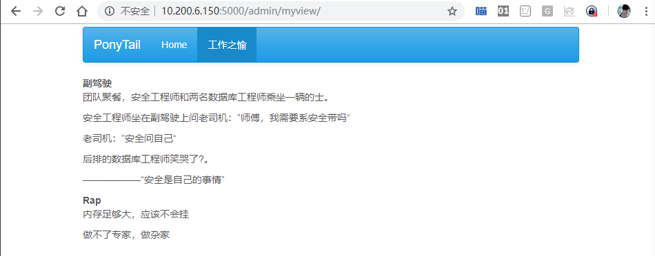
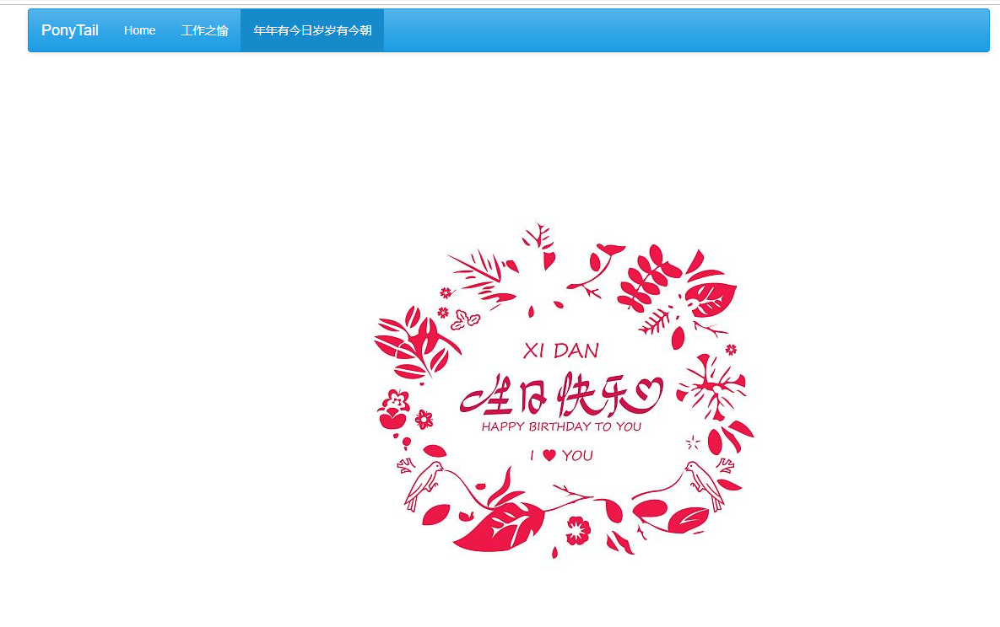

# 03_添加一个静态页面

> 2018-11-02  大宝

[TOC]

## 1 效果图

网站添加了一个页面“工作之愉”，该页面（View）上展示的就是一些文字。



## 2 代码说明

```shell
class MyView(BaseView):
    @expose('/')
    def index(self):
        return self.render('happy.html')

admin.add_view(MyView(name=u'工作之愉'))
```

要运行以上代码我们需要做以下步骤

* 导入两个模块：`flask_admin.BaseView`和`flask_admin.expose`

* 准备一个页面`happy.html`，页面存放位置为`/home/myweb/PonyTail/templates/目录下`
* 为页面取一个名字`工作之愉`

## 3 操作指南

使用myweb用户登陆服务器，修改manage.py

```bash
[myweb@am_01 PonyTail]$ pwd
/home/myweb/PonyTail
[myweb@am_01 PonyTail]$ vim manage.py 
```

manage.py代码整体如下：

```python
# -*- coding:utf8 -*- 

from flask import Flask
from flask_admin import Admin
from flask_admin import BaseView 
from flask_admin import expose   

app = Flask(__name__)

#set optional bootswatch theme
app.config['FLASK_ADMIN_SWATCH'] = 'cerulean'
admin = Admin(app, name='PonyTail', template_mode='bootstrap3')
# Add administrative views here

class Happy(BaseView):
    @expose('/')
    def index(self):
        return self.render('happy.html')

admin.add_view(Happy(name=u'工作之愉'))

app.run(debug=True,host='0.0.0.0',port=5000)
```

创建新的页面`/home/myweb/PonyTail/templates/happy.html`

```bash
[myweb@am_01 PonyTail]$ mkdir templates
[myweb@am_01 PonyTail]$ vim templates/happy.html
```

`happy.html`内容如下：

```html


<b>副驾驶</b>

<p>团队聚餐，安全工程师和两名数据库工程师乘坐一辆的士。</p>

<p>安全工程师坐在副驾驶上问老司机：”师傅，我需要系安全带吗“</p>

<p>老司机：”安全问自己“</p>

<p>后排的数据库工程师笑哭了?。</p>

<p>——————“安全是自己的事情”</p>

<b>Rap</b>

<p>内存足够大，应该不会挂</p>

<p>做不了专家，做杂家</p>

```

> happy.html页面语法请参考[Jinjia2文档](https://link.jianshu.com/?t=http://docs.jinkan.org/docs/jinja2/) 和 [html文档](http://www.w3school.com.cn/tags/html_ref_byfunc.asp)


运行程序

```shell
[myweb@am_01 PonyTail]$ python manage.py 
 * Serving Flask app "manage" (lazy loading)
 * Environment: production
   WARNING: Do not use the development server in a production environment.
   Use a production WSGI server instead.
 * Debug mode: on
 * Running on http://0.0.0.0:5000/ (Press CTRL+C to quit)
 * Restarting with stat
 * Debugger is active!
 * Debugger PIN: 476-676-292
```

访问网站`http://10.200.6.150:5000/admin/happy/`则直接进入新建页面“工作之愉”。

## 4 课后练习

访问网站`http://10.200.6.150:5000/admin/birthday/`则进入新建页面"年年有今日岁岁有今朝"。



```shell
vim  /home/myweb/PonyTail/templates/birthday.html
```

`birthday.html`内容如下：

```html




```

修改manage.py

```bash
# -*- coding:utf8 -*- 

from flask import Flask
from flask_admin import Admin
from flask_admin import BaseView
from flask_admin import expose

app = Flask(__name__)

#set optional bootswatch theme
app.config['FLASK_ADMIN_SWATCH'] = 'cerulean'
admin = Admin(app, name='PonyTail', template_mode='bootstrap3')
# Add administrative views here

class Happy(BaseView):
    @expose('/')
    def index(self):
        return self.render('index.html')

class Birthday(BaseView):
    @expose('/')
    def index(self):
        return self.render('birthday.html')

admin.add_view(Happy(name=u'工作之愉'))
admin.add_view(Birthday(name=u'年年有今日岁岁有今朝'))

app.run(debug=True,host='0.0.0.0',port=5000)                                          
```

