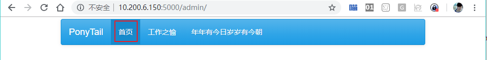

# 04_网站从英文改为中文

> 2018-11-02  大宝

[TOC]

## 1 效果图

“Home” 已经被汉化为 "首页"。



## 2 代码说明

网页默认显示全是英文，需要汉化处理，Flask-Admin自带国际化，修改manage.py代码

```shell
babel = Babel(app)
app.config['BABEL_DEFAULT_LOCALE'] = 'zh_CN'
```

要运行以上代码我们需要做以下步骤

* 安装模块：`pip install flask_babelex`
* 导入模块：`flask_babelex.Babel`

## 3 操作指南

使用myweb用户登陆服务器，修改manage.py

```bash
[myweb@am_01 PonyTail]$ pwd
/home/myweb/PonyTail
[myweb@am_01 PonyTail]$ vim manage.py 
```

manage.py代码整体如下：

```python
# -*- coding:utf8 -*- 

from flask import Flask
from flask_admin import Admin
from flask_admin import BaseView
from flask_admin import expose
from flask_babelex import Babel


app = Flask(__name__)
babel = Babel(app)

#set optional bootswatch theme
app.config['FLASK_ADMIN_SWATCH'] = 'cerulean'
app.config['BABEL_DEFAULT_LOCALE'] = 'zh_CN'


admin = Admin(app, name='PonyTail', template_mode='bootstrap3')
# Add administrative views here

class Happy(BaseView):
    @expose('/')
    def index(self):
        return self.render('happy.html')

class Birthday(BaseView):
    @expose('/')
    def index(self):
        return self.render('birthday.html')


admin.add_view(Happy(name=u'工作之愉'))
admin.add_view(Birthday(name=u'年年有今日岁岁有今朝'))

app.run(debug=True,host='0.0.0.0',port=5000)                                         
```

安装模块`flask_babelex`

```bash
[myweb@am_01 PonyTail]$ pip install flask_babelex --user
```

运行程序

```shell
[myweb@am_01 PonyTail]$ python manage.py 
 * Serving Flask app "manage" (lazy loading)
 * Environment: production
   WARNING: Do not use the development server in a production environment.
   Use a production WSGI server instead.
 * Debug mode: on
 * Running on http://0.0.0.0:5000/ (Press CTRL+C to quit)
 * Restarting with stat
 * Debugger is active!
 * Debugger PIN: 476-676-292
```

访问网站`http://10.200.6.150:5000/admin/`可以看到网站已经汉化。