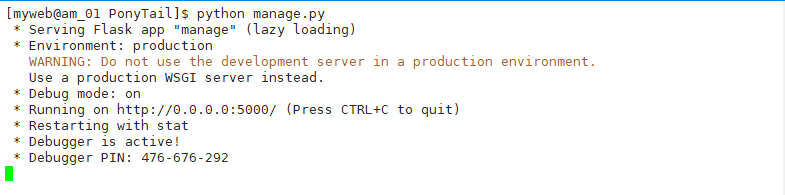

# 01_搭建工作记录管理系统的准备工作

> 2018-11-02 大宝

[TOC]

## 1. 开发环境准备

| 环境       | 明细         |
| ---------- | ------------ |
| 操作系统   | centos 7     |
| Python版本 | 2.6 +        |
| ip地址     | 10.200.6.150 |

## 2. 新建用户myweb

```shell
useradd myweb
passwd myweb
```

## 3. 新建项目目录PonyTail

切换到myweb家目录

```shell
su - myweb
```

创建项目目录PonyTail

```shell
mkdir PonyTail
```

## 4. 安装软件包pip

从myweb用户退出，登陆为root用户后执行以下步骤：

需要先安装扩展源EPEL

```shell
yum install -y epel-release
```

再安装pip

```shell
yum -y install python-pip
```

最后升级pip（必须执行该步骤）

```shell
pip install --upgrade pip
```


## 5. 安装python模块flask-admin

[Flask-Admin](https://flask-admin.readthedocs.io/en/latest/)是一个简单易用的Flask扩展，让你可以很方便并快速地为Flask应用程序增加管理界面。

```shell
pip install flask-admin
```

## 6. 编写第一个测试脚本

```shell
su - myweb
cd PonyTail
vim manage.py
```

manage.py的内容如下：

```python
# -*- coding:utf8 -*- 
from flask import Flask
from flask_admin import Admin

app = Flask(__name__)

admin = Admin(app, name='PonyTail', template_mode='bootstrap3')
# Add administrative views here

app.run(debug=True,host='0.0.0.0',port=5000)
```

开始运行

```shell
python manage.py
```



通过浏览器登陆访问`http://10.200.6.150:5000/admin/`

> 注意：监听端口和admin目录别忘记


到目前为止通过一个测试脚本，已经可以将网站成功显示出来了。