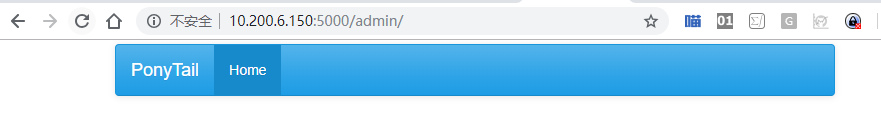

# 02_调整网站色调为蓝色

> 2018-11-02  大宝

[TOC]

## 1. 效果图

网站从原来的白色改为了蓝色



## 2 修改网站色调的代码说明

以下代码将会调整网站的色调，由默认的白色改为蓝色。

```shell
app.config['FLASK_ADMIN_SWATCH'] = 'cerulean'
```

## 3 操作指南

使用myweb用户登陆服务器，修改manage.py

```bash
[myweb@am_01 PonyTail]$ pwd
/home/myweb/PonyTail
[myweb@am_01 PonyTail]$ vim manage.py 
```

manage.py代码整体如下：

```python
# -*- coding:utf8 -*- 

from flask import Flask
from flask_admin import Admin

app = Flask(__name__)

#set optional bootswatch theme
app.config['FLASK_ADMIN_SWATCH'] = 'cerulean'
admin = Admin(app, name='PonyTail', template_mode='bootstrap3')

app.run(debug=True,host='0.0.0.0',port=5000)
```

运行程序

```shell
[myweb@am_01 PonyTail]$ python manage.py 
 * Serving Flask app "manage" (lazy loading)
 * Environment: production
   WARNING: Do not use the development server in a production environment.
   Use a production WSGI server instead.
 * Debug mode: on
 * Running on http://0.0.0.0:5000/ (Press CTRL+C to quit)
 * Restarting with stat
 * Debugger is active!
 * Debugger PIN: 476-676-292

```


