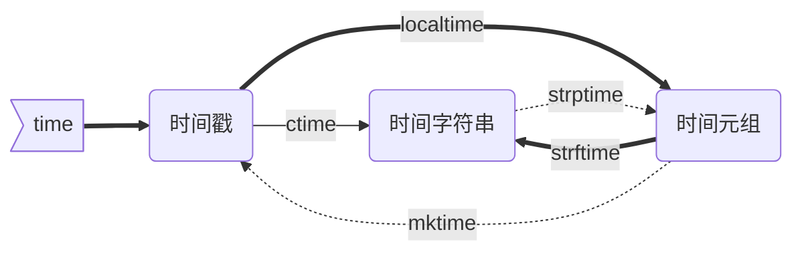
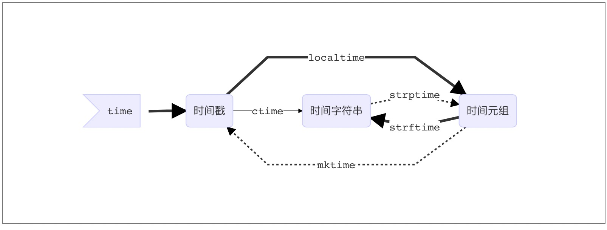

<!-- TOC depthFrom:1 depthTo:6 withLinks:1 updateOnSave:1 orderedList:0 -->

- [09_Python模块和包](#09python模块和包)
	- [模块(`Module`)的概念](#模块module的概念)
		- [模块的好处](#模块的好处)
		- [模块的种类](#模块的种类)
	- [模块导入方法](#模块导入方法)
		- [`import` 语句](#import-语句)
		- [`from…import` 语句](#fromimport-语句)
		- [`From … import *` 语句](#from-import-语句)
		- [运行本质](#运行本质)
	- [包(`Package`)](#包package)
		- [注意点（important）](#注意点important)
			- [第一点](#第一点)
			- [第二点](#第二点)
			- [第三点](#第三点)
	- [time模块](#time模块)
		- [三种时间表示](#三种时间表示)
		- [三种时间的关系](#三种时间的关系)
	- [random模块](#random模块)
			- [验证码](#验证码)
	- [os模块](#os模块)
		- [常用方法](#常用方法)
	- [sys模块](#sys模块)
		- [进度条](#进度条)
	- [json模块](#json模块)
	- [pickle模块](#pickle模块)
	- [shelve模块](#shelve模块)
	- [xml模块](#xml模块)
	- [configpaser模块](#configpaser模块)
	- [yaml模块](#yaml模块)
	- [hashlib模块](#hashlib模块)
	- [subprocess模块](#subprocess模块)
	- [logging模块](#logging模块)
	- [re模块](#re模块)
	- [argparse模块](#argparse模块)
	- [参考](#参考)

<!-- /TOC -->

# 09_Python模块和包

## 模块(`Module`)的概念

在计算机程序的开发过程中，随着程序代码越写越多，在一个文件里代码就会越来越长，越来越不容易维护。

为了编写可维护的代码，我们把很多函数分组，分别放到不同的文件里，这样每个文件包含的代码就相对较少，很多编程语言都采用这种组织代码的方式。在Python中，一个`.py`文件就称之为一个模块（`Module`）。

### 模块的好处

最大的好处是大大提高了代码的可维护性。

其次，编写代码不必从零开始。当一个模块编写完毕，就可以被其他地方引用。我们在编写程序的时候，也经常引用其他模块，包括Python内置的模块和来自第三方的模块。

### 模块的种类

* python标准库
* 第三方模块
* 应用程序自定义模块

注意：

1. 使用模块还可以避免函数名和变量名冲突。相同名字的函数和变量完全可以分别存在不同的模块中，因此，我们自己在编写模块时，不必考虑名字会与其他模块冲突。
2. 但是也要注意，尽量不要与内置函数名字冲突。

## 模块导入方法

### `import` 语句

```python3
import module1[, module2[,... moduleN]
```

当我们使用import语句的时候，Python解释器是怎样找到对应的文件的呢？答案就是解释器有自己的搜索路径，存在`sys.path`里。　　

```python3
['', '/usr/lib/python3.4', '/usr/lib/python3.4/plat-x86_64-linux-gnu',
'/usr/lib/python3.4/lib-dynload', '/usr/local/lib/python3.4/dist-packages', '/usr/lib/python3/dist-packages']　　
```

**因此若像我一样在当前目录下存在与要引入模块同名的文件，就会把要引入的模块屏蔽掉。**

### `from…import` 语句

```python3
from modname import name1[, name2[, ... nameN]]
```

这个声明不会把整个`modulename`模块导入到当前的命名空间中，只会将它里面的`name`1或`name2`单个引入到执行这个声明的模块的全局符号表。

### `From … import *` 语句


```python3
from modname import *
```

这提供了一个简单的方法来导入一个模块中的所有项目。然而这种声明不该被过多地使用。大多数情况， Python程序员不使用这种方法，因为引入的其它来源的命名，很可能覆盖了已有的定义。

### 运行本质　

```python3
import test
from test import add　　
```

无论`1`还是`2`，首先通过`sys.path`找到`test.py`,然后执行`test`脚本（全部执行）;
区别是:
* `1`会将`test`这个变量名加载到名字空间
  * 而`2`只会将add这个变量名加载到名字空间　　

## 包(`Package`)

如果不同的人编写的模块名相同怎么办？为了避免模块名冲突，Python又引入了按目录来组织模块的方法，称为包（`Package`）。

举个例子，一个`abc.py`的文件就是一个名字叫`abc`的模块，一个`xyz.py`的文件就是一个名字叫`xyz`的模块。

现在，假设我们的`abc`和`xyz`这两个模块名字与其他模块冲突了，于是我们可以通过包来组织模块，避免冲突。方法是选择一个顶层包名：

引入了包以后，只要顶层的包名不与别人冲突，那所有模块都不会与别人冲突。现在，`view.py`模块的名字就变成了`hello_django.app01.views`，类似的，`manage.py`的模块名则是`hello_django.manage`。

请注意，每一个包目录下面都会有一个`__init__.p`y的文件，这个文件是必须存在的，否则，Python就把这个目录当成普通目录(文件夹)，而不是一个包。`__init__.py`可以是空文件，也可以有Python代码，因为`__init__.py`本身就是一个模块，而它的模块名就是对应包的名字。

调用包就是执行包下的`__init__.py`文件

### 注意点（important）


#### 第一点

手动将程序执行的路径加入`sys.path`

```python3
import sys,os
BASE_DIR=os.path.dirname(os.path.dirname(os.path.abspath(__file__)))
sys.path.append(BASE_DIR)
import hello
hello.hello1()
```

#### 第二点

```python3
if __name__=='__main__':
    print('ok')
```

“Make a .py both importable and executable”

如果我们是直接执行某个`.py`文件的时候，该文件中那么`__name__ == '__main__'`是`True`,但是我们如果从另外一个`.py`文件通过`import`导入该文件的时候，这时`__name__`的值就是我们这个`py`文件的名字而不是`__main__`。

这个功能还有一个用处：调试代码的时候，在`if __name__ == '__main__'`中加入一些我们的调试代码，我们可以让外部模块调用的时候不执行我们的调试代码，但是如果我们想排查问题的时候，直接执行该模块文件，调试代码能够正常运行！

#### 第三点

`/Users/yuanhao/Desktop/whaterver/project/web/module/cal.py`

```python3
def add(x,y):
    return x+y
```

`/Users/yuanhao/Desktop/whaterver/project/web/module/main.py`

```python3
import cal      #from module import cal

def main():

    cal.add(1,2)
```


`/Users/yuanhao/Desktop/whaterver/project/web/bin.py`

```python3
from module import main

main.main()
```


1. `from module import main` 改成 `from . import main`同样可以，这是因为`bin.py`是我们的执行脚本，`sys.path`里有`bin.py`的当前环境。即`/Users/yuanhao/Desktop/whaterver/project/web`这层路径，无论`import what` ,  解释器都会按这个路径找。
所以当执行到`main.py`时，`import cal`会找不到，因为`sys.path`里没有`/Users/yuanhao/Desktop/whaterver/project/web/module`这个路径，而`from  module/.  import cal` 时，解释器就可以找到了。

## time模块

### 三种时间表示

在Python中，通常有这几种方式来表示时间：

- A时间戳(timestamp) : 通常来说，时间戳表示的是从1970年1月1日00:00:00开始按秒计算的偏移量。我们运行“type(time.time())”，返回的是float类型。
- B格式化的时间字符串
- C元组(struct_time):struct_time元组共有9个元素共九个元素:(年，月，日，时，分，秒，一年中第几周，一年中第几天，夏令时)

```python
import time

a1 = time.time()
a2 = time.localtime()
a3 = time.gmtime()
a4 = time.mktime(a2)
a5 = time.asctime(a2)
a6 = time.ctime(a1)
a7 = time.strftime('%Y-%m-%d %X', a2)
a8 = time.strptime(a7, '%Y-%m-%d %X')
for i in [a1, a2, a3, a4, a5, a6, a7, a8]:
    print(i)
```

### 三种时间的关系





## random模块

| 方法                                      | 说明                                                         |
| ----------------------------------------- | ------------------------------------------------------------ |
| `random.random()`                         | 用于生成一个0到1的随机浮点数：0<= n < 1.0                    |
| `random.uniform(a,b)`                     | 用于生成一个指定范围内的随机符点数，两个参数其中一个是上限，一个是下限。如果a > b，则生成的随机数n: a <= n <= b。如果 a <b， 则 b <= n <= a |
| `random.randint(a, b)`                    | 用于生成一个指定范围内的整数。其中参数a是下限，参数b是上限，生成的随机数n: a <= n <= b |
| `random.randrange([start], stop[, step])` | 从指定范围内，按指定基数递增的集合中 获取一个随机数          |
| `random.choice(sequence)`                 | 从序列中获取一个随机元素                                     |
| `random.shuffle(x[, random])`             | 用于将一个列表中的元素打乱,即将列表内的元素随机排列          |
| `random.sample(sequence, k)`              | 从指定序列中随机获取指定长度的片断并随机排列。注意：sample函数不会修改原有序列。 |

#### 验证码

```python
import random

def v_code():

    code = ''
    for i in range(5):

        num=random.randint(0,9)
        alf=chr(random.randint(65,90))
        add=random.choice([num,alf])
        code += str(add)
    return code

print(v_code())
```

## os模块

os模块是与操作系统交互的接口

### 常用方法

|              | 方法                                  | 说明                                                         |
| ------------ | ------------------------------------- | ------------------------------------------------------------ |
| 目录         | `os.getcwd()`                         | 获取当前工作目录，即当前python脚本工作的目录路径             |
|              | `os.chdir("dirname")`                 | 改变当前脚本工作目录；相当于shell下cd                        |
|              | `os.curdir`                           | 返回当前目录                                                 |
|              | `os.pardir`                           | 获取当前目录的父目录字符串名                                 |
|              | `os.makedirs('dirname1/dirname2')`    | 可生成多层递归目录                                           |
|              | `os.removedirs('dirname1')`           | 若目录为空，则删除，并递归到上一级目录，如若也为空，则删除，依此类推 |
|              | `os.mkdir('dirname')`                 | 生成单级目录；相当于shell中mkdir dirname                     |
|              | `os.rmdir('dirname')`                 | 删除单级空目录，若目录不为空则无法删除，报错；相当于shell中rmdir dirname |
|              | `os.listdir('dirname')`               | 列出指定目录下的所有文件和子目录，包括隐藏文件，并以列表方式打印 |
|              | `os.remove()`                         | 删除文件                                                     |
|              | `os.rename("oldname","newname")`      | 重命名文件/目录                                              |
|              | `os.stat('path/filename')`            | 获取文件/目录信息                                            |
| 符号         | `os.sep`                              | 输出操作系统特定的路径分隔符，win下为"\\",Linux下为"/"       |
|              | `os.linesep`                          | 输出当前平台使用的行终止符，win下为"\t\n",Linux下为"\n"      |
|              | `os.pathsep`                          | 输出用于分割文件路径的字符串                                 |
|              | `os.name`                             | 输出字符串指示当前使用平台。win->'nt'; Linux->'posix'        |
| 执行系统命令 | `os.system("bash command")`           | 运行shell命令，直接显示                                      |
|              | `os.environ`                          | 获取系统环境变量                                             |
| 路径         | `os.path.abspath(path)`               | 返回path规范化的绝对路径                                     |
|              | `os.path.split(path)`                 | 将path分割成目录和文件名二元组返回                           |
|              | `os.path.dirname(path)`               | 返回path的目录。其实就是os.path.split(path)的第一个元素      |
|              | `os.path.basename(path)`              | 返回path最后的文件名。如何path以／或\结尾，那么就会返回空值。即os.path.split(path)的第二个元素 |
|              | `os.path.exists(path)`                | 如果path存在，返回True；如果path不存在，返回False            |
|              | `os.path.isabs(path)`                 | 如果path是绝对路径，返回True                                 |
|              | `os.path.isfile(path)`                | 如果path是一个存在的文件，返回True;否则返回False             |
|              | `os.path.isdir(path)`                 | 如果path是一个存在的目录，则返回True;否则返回False           |
|              | `os.path.join(path1[, path2[, ...]])` | 将多个路径组合后返回，第一个绝对路径之前的参数将被忽略       |
|              | `os.path.getatime(path)`              | 返回path所指向的文件或者目录的最后存取时间                   |
|              | `os.path.getmtime(path)`              | 返回path所指向的文件或者目录的最后修改时间                   |

## sys模块

| 方法           | 说明                                                   |
| -------------- | ------------------------------------------------------ |
| `sys.argv`     | 命令行参数                                             |
| `sys.exit(n)`  | 退出程序                                               |
| `sys.version`  | 获取Python解释程序的版本信息                           |
| `sys.maxint`   | 最大的整型                                             |
| `sys.path`     | 返回模块的搜索路径，初始化时使用PYTHONPATH环境变量的值 |
| `sys.platform` | 返回操作系统平台名称                                   |

### 进度条

```python
import sys, time

for i in range(10):
    sys.stdout.write('#')
    time.sleep(1)
    sys.stdout.flush()
```

缓冲区的刷新方式：

1. flush()刷新缓存区
2. 缓冲区满时，自动刷新
3. 文件关闭或者是程序结束自动刷新。

当我们打印一些字符时，并不是调用print函数后就立即打印的。一般会先将字符送到缓冲区，然后再打印。这就存在一个问题，如果你想等时间间隔的打印一些字符，但由于缓冲区没满，不会打印。就需要采取一些手段。如每次打印后强行刷新缓冲区`sys.stdout.flush()`。

## json模块

> 重点掌握

如果我们要在不同的编程语言之间传递对象，就必须把对象序列化为标准格式，比如XML，但更好的方法是序列化为JSON，因为JSON表示出来就是一个字符串，可以被所有语言读取，也可以方便地存储到磁盘或者通过网络传输。JSON不仅是标准格式，并且比XML更快，而且可以直接在Web页面中读取，非常方便。

JSON表示的对象就是标准的JavaScript语言的对象，JSON和Python内置的数据类型对应如下：

| json类型     | python类型   |
| ------------ | ------------ |
| `{}`         | `dict`       |
| `[]`         | `list`       |
| `string`     | `str`        |
| `123.45`     | `int/float`  |
| `true/false` | `True/Flase` |
| `null`       | `None`       |

```python
import json

a = {
    'name': 'booboo',
    'goods': ['机票', '酒店']
}

a_json = json.dumps(a, indent=2, ensure_ascii=False)

b_json = """
{
  "name": "booboo",
  "goods": [
    "机票",
    "酒店"
  ]
}
"""

b_dict = json.loads(b_json)

print(type(a_json), a_json)
print(type(b_dict), b_json)
```

常用：

1. `json.dumps(a, indent=2, ensure_ascii=False)`显示中文
2. 与数据库交互时，时间和浮点数需要特殊处理：

```python
import json
import datetime
import decimal

class CJsonEncoder(json.JSONEncoder):
    def default(self, obj):
        if isinstance(obj, datetime.datetime):
            return obj.strftime('%Y-%m-%d %H:%M:%S')
        if isinstance(obj, decimal.Decimal):
            return str(obj)
        else:
            return json.JSONEncoder.default(self, obj)

result = "从数据库中查询的结果集"
print(json.dumps(result, cls=CJsonEncoder, ensure_ascii=False, indent=2))         
```


## pickle模块

> 从来没有用过

Pickle的问题和所有其他编程语言特有的序列化问题一样，就是它只能用于Python，并且可能不同版本的Python彼此都不兼容，因此，只能用Pickle保存那些不重要的数据，不能成功地反序列化也没关系。

```python
import pickle
dic = {'name': 'booboo', 'age': 10, 'sex': 'female'}
j = pickle.dumps(dic)
```


## shelve模块

* shelve模块比pickle模块简单，只有一个open函数，返回类似字典的对象，可读可写；
* key必须为字符串，而值可以是python所支持的数据类型。

```python
import shelve

f = shelve.open(r'shelve.db')
f['name'] = 'booboo'
f['age'] = 10
f.close()

s = shelve.open('shelve.db', flag='w', writeback=True)
s['home'] = 'shanghai'
s.close()
```

writeback：默认为False。当设置为True以后，shelf将会将所有从DB中读取的对象存放到一个内存缓存。当我们close()打开的shelf的时候，缓存中所有的对象会被重新写入DB。
writeback方式有优点也有缺点。

优点是减少了我们出错的概率，并且让对象的持久化对用户更加的透明了；但这种方式并不是所有的情况下都需要，首先，使用writeback以后，shelf在open()的时候会增加额外的内存消耗，并且当DB在close()的时候会将缓存中的每一个对象都写入到DB，这也会带来额外的等待时间。因为shelve没有办法知道缓存中哪些对象修改了，哪些对象没有修改，因此所有的对象都会被写入。

[帮助](https://www.cnblogs.com/sui776265233/p/9225164.html)

## xml模块

xml是实现不同语言或程序之间进行数据交换的协议，跟json差不多，但json使用起来更简单，不过，古时候，在json还没诞生的黑暗年代，大家只能选择用xml呀，至今很多传统公司如金融行业的很多系统的接口还主要是xml。

xml的格式如下，就是通过`<>`节点来区别数据结构的:

```xml
<?xml version="1.0"?>
<data>
    <country name="Liechtenstein">
        <rank updated="yes">2</rank>
        <year>2008</year>
        <gdppc>141100</gdppc>
        <neighbor name="Austria" direction="E"/>
        <neighbor name="Switzerland" direction="W"/>
    </country>
    <country name="Singapore">
        <rank updated="yes">5</rank>
        <year>2011</year>
        <gdppc>59900</gdppc>
        <neighbor name="Malaysia" direction="N"/>
    </country>
    <country name="Panama">
        <rank updated="yes">69</rank>
        <year>2011</year>
        <gdppc>13600</gdppc>
        <neighbor name="Costa Rica" direction="W"/>
        <neighbor name="Colombia" direction="E"/>
    </country>
</data>
```

xml协议在各个语言里的都 是支持的，在python中可以用以下模块操作xml：

```python
import xml.etree.ElementTree as ET

tree = ET.parse("xmltest.xml")
root = tree.getroot()
print(root.tag)

"""
遍历xml文档
"""
for child in root:
    print(child.tag, child.attrib)
    for i in child:
        print(i.tag,i.text)

"""
只遍历year 节点
"""
for node in root.iter('year'):
    print(node.tag,node.text)


import xml.etree.ElementTree as ET

tree = ET.parse("xmltest.xml")
root = tree.getroot()

"""修改"""
for node in root.iter('year'):
    new_year = int(node.text) + 1
    node.text = str(new_year)
    node.set("updated","yes")

tree.write("xmltest.xml")


"""删除node"""
for country in root.findall('country'):
   rank = int(country.find('rank').text)
   if rank > 50:
     root.remove(country)

tree.write('output.xml')
```

自己创建xml文档：

```python
import xml.etree.ElementTree as ET


new_xml = ET.Element("namelist")
name = ET.SubElement(new_xml,"name",attrib={"enrolled":"yes"})
age = ET.SubElement(name,"age",attrib={"checked":"no"})
sex = ET.SubElement(name,"sex")
sex.text = '33'
name2 = ET.SubElement(new_xml,"name",attrib={"enrolled":"no"})
age = ET.SubElement(name2,"age")
age.text = '19'

et = ET.ElementTree(new_xml)
et.write("test.xml", encoding="utf-8",xml_declaration=True)

ET.dump(new_xml)
```

## configpaser模块

一般软件的常见文档格式如下：

```
[DEFAULT]
ServerAliveInterval = 45
Compression = yes
CompressionLevel = 9
ForwardX11 = yes

[bitbucket.org]
User = hg

[topsecret.server.com]
Port = 50022
ForwardX11 = no
```

如果想用python生成一个这样的文档怎么做呢？


```python
import configparser

config = configparser.ConfigParser()
config["DEFAULT"] = {'ServerAliveInterval': '45',
                      'Compression': 'yes',
                      'CompressionLevel': '9'}

config['bitbucket.org'] = {}
config['bitbucket.org']['User'] = 'hg'
config['topsecret.server.com'] = {}
topsecret = config['topsecret.server.com']
topsecret['Host Port'] = '50022'     # mutates the parser
topsecret['ForwardX11'] = 'no'  # same here
config['DEFAULT']['ForwardX11'] = 'yes'<br>
with open('example.ini', 'w') as configfile:
   config.write(configfile)
```

## yaml模块

> 重点掌握

自研小工具时可以将配置文件的格式设置为`yaml`， 例如：

```
version: 1
ak:
  AccessKeyId:
  AccessKeySecret:

action:
  global_enable: True
  create_contact:
    is_enable: True
    params:
      [
      {
        "Channels.Mail": "abc@xxx.com",
        "Channels.SMS": 15000137000,
        "Describe": "abc",
        "ContactName": "abc"
      }
      ]
```

读取配置文件时：

```python
import yaml
config_file = 'config.yaml'
with open(config_file, 'r') as f:
  config = yaml.safe_load(f.read())
  print(type(config))
  print(json.dumps(config, indent=2))
```

[帮助文档](https://www.jianshu.com/p/eaa1bf01b3a6)


## hashlib模块

用于加密相关的操作，3.x里代替了md5模块和sha模块，主要提供 SHA1, SHA224, SHA256, SHA384, SHA512 ，MD5 算法。

```python
import hashlib

m = hashlib.md5()

m.update('hello'.encode('utf8'))
print(m.hexdigest())

m.update('alvin'.encode('utf8'))

print(m.hexdigest())

m2 = hashlib.md5()
m2.update('hello word'.encode('utf8'))
print(m2.hexdigest())

m3 = hashlib.sha256()
print(m3.hexdigest())
```

以上加密算法虽然依然非常厉害，但时候存在缺陷，即：通过撞库可以反解。所以，有必要对加密算法中添加自定义key再来做加密。

```python
import hashlib

a = hashlib.sha256('hello'.encode('utf8'))
a.update('booboo'.encode('utf8'))
print(a.hexdigest())
```

python 还有一个 hmac 模块，它内部对我们创建 key 和 内容 再进行处理然后再加密:

```python
import hmac

h = hmac.new('booboo'.encode('utf8'))
h.update('hello'.encode('utf8'))
print(h.hexdigest())
```

## subprocess模块

> 重点掌握

当我们需要调用系统的命令的时候，最先考虑的os模块。用os.system()和os.popen()来进行操作。但是这两个命令过于简单，不能完成一些复杂的操作，如给运行的命令提供输入或者读取命令的输出，判断该命令的运行状态，管理多个命令的并行等等。这时subprocess中的Popen命令就能有效的完成我们需要的操作。

subprocess模块允许一个进程创建一个新的子进程，通过管道连接到子进程的stdin/stdout/stderr，获取子进程的返回值等操作。

[python基础中已重点介绍，此处省略](https://github.com/BoobooWei/booboo_python/blob/master/04-python.md)

## logging模块

> 重点掌握

**灵活配置日志级别，日志格式，输出位置**

```yaml
version: 1
disable_existing_loggers: False
formatters:
    simple:
        format: "%(asctime)s\nFile %(filename)s, [%(levelname)s] [lines: %(lineno)s] %(message)s"

handlers:
    console:
        class: logging.StreamHandler
        level: INFO
        formatter: simple
        stream: ext://sys.stdout

    debug_file_handler:
        class: logging.handlers.RotatingFileHandler
        level: DEBUG
        formatter: simple
        filename: ./logs/info.log
        maxBytes: 10485760
        backupCount: 20
        encoding: utf8

    warning_file_handler:
        class: logging.handlers.RotatingFileHandler
        level: WARNING
        formatter: simple
        filename: ./logs/warning.log
        maxBytes: 10485760
        backupCount: 20
        encoding: utf8

loggers:
  simpleExample:
    level: WARNING
    handlers: [warning_file_handler]
    propagate: no

root:
    level: DEBUG
    handlers: [console, debug_file_handler, warning_file_handler]
```


## re模块

re是一个用来处理正则表达式的库

| 方法    | 说明                                                         |
| ------- | ------------------------------------------------------------ |
| compile | 将一个正则表达式“编译”。编译后的正则表达式对象比直接运行拥有更快的速度。 |
| search  | 在一系列文字中搜索。                                         |
| match   | 在一系列文字中匹配。                                         |
| split   | 利用正则将文字分裂为多个部分。                               |
| findall | 找到所有符合正则的子字符串。                                 |
| sub     | 对文本进行替换。                                             |

[帮助文档](https://www.jianshu.com/p/d3cbab5874e4)

[re参考案例](https://github.com/BoobooWei/DBA_Mysql/blob/master/scripts/analyze/pythonshell/binlog_analyze.py)


## argparse模块

[帮助文档](https://docs.python.org/3/library/argparse.html)

> 需要开发一些小工具时的必要第三方包！

## 参考

[参考文章](https://www.cnblogs.com/yuanchenqi/articles/5732581.html)
